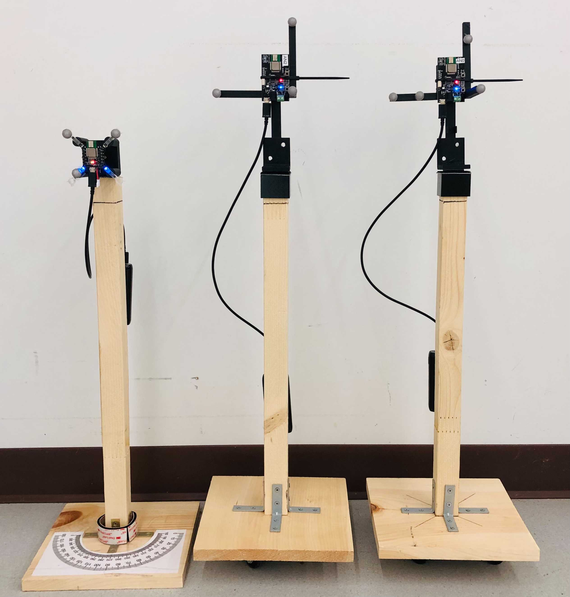
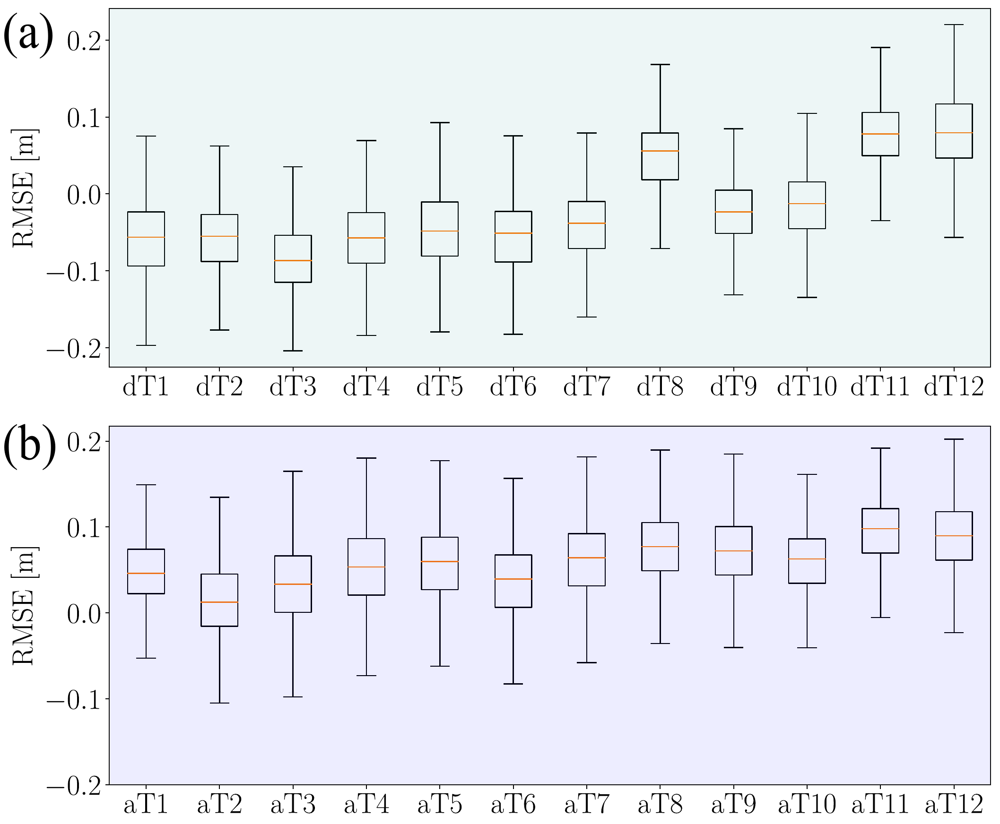
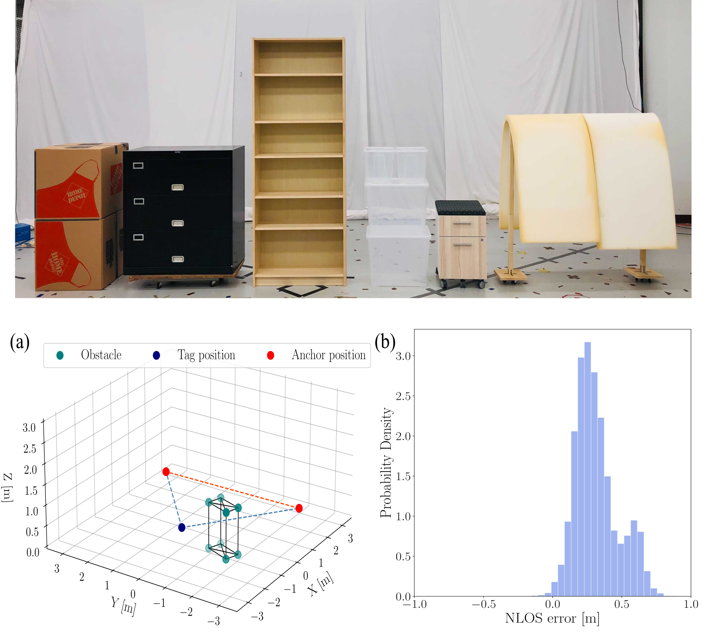
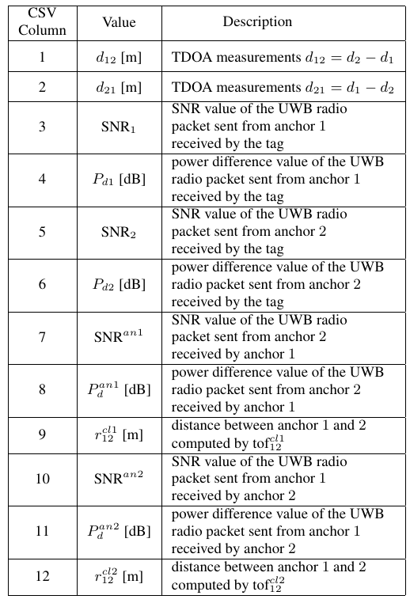
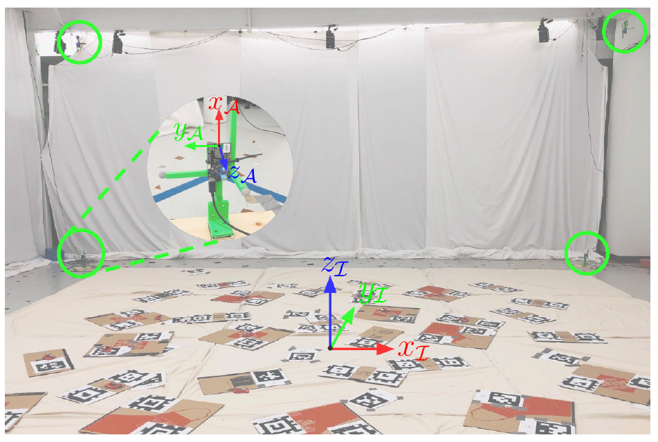
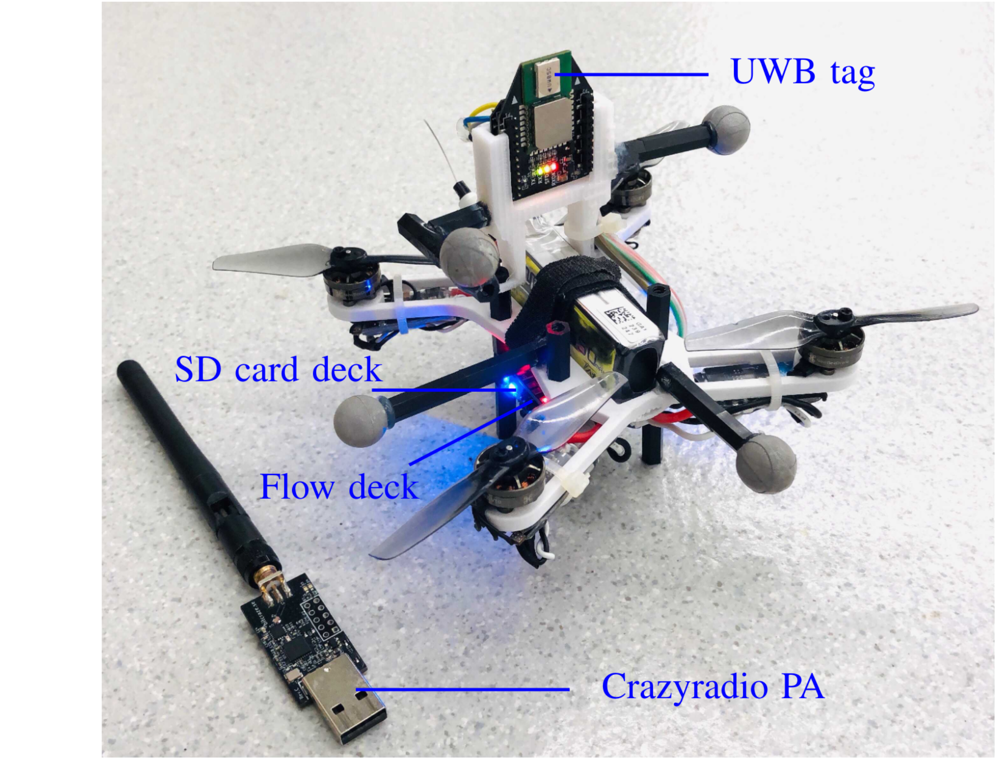
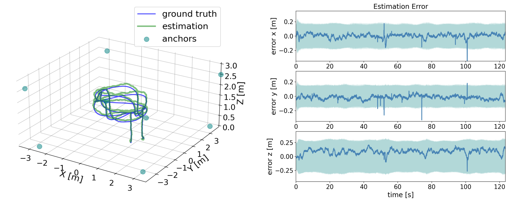
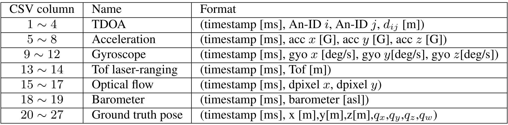

---
## Overview
Ultra-wideband (UWB) time-difference-of-arrival (TDOA)-based localization has recently emerged as a promising, low-cost, and scalable indoor localization solution, which is especially suited for multi-robot applications. To benchmark the emerging UWB TDOA positioning technology in cluttered indoor environments, we present a comprehensive dataset consists of UWB TDOA identification experiments and flight experiments based on Decawave's DWM1000 UWB modules. In the identification experiments, we collected low-level signal information, including signal-to-noise ratio (SNR) and power difference values, in various line-of-sight (LOS) and non-line-of-sight (NLOS) conditions. For the flight experiments, we conducted a cumulative ~150 minutes of real-world flights with an average speed of 0.45 m/s using four different anchor constellations. Raw sensor data including UWB TDOA, inertial measurement unit (IMU), optical flow, time-of-flight (ToF) laser, and millimeter-accurate ground truth data were collected during the flights. We use the [Loco Positioning System (LPS)](https://www.bitcraze.io/documentation/system/positioning/loco-positioning-system/) from [Bitcraze](https://www.bitcraze.io/) to create this dataset. We hope this dataset can help researchers develop and compare reliable estimation methods for emerging UWB TDOA-based indoor localization technology. 

---
## Identification Dataset
<!-- To identify the UWB TDOA measurement performance in different scenarios, we designed a variety of identification experiments in LOS and NLOS scenarios. Two UWB anchors and one [Crazyflie nano-quadrotor](https://www.bitcraze.io/products/old-products/crazyflie-2-0/) equipped with an UWB tag are placed on wooden structures. A millimeter-level accurate Vicon motion capture system measures the poses of the tag and the anchors for ground truth data. We demonstrate our experimental setups in the following figure.
 -->

<div style="clear: both;">
  <div style="float: right; margin-left 5em;">
     &nbsp; &nbsp;&nbsp;&nbsp;
    
  </div>
  <div>
    <p>To identify the UWB TDOA measurement performance in different scenarios, we designed a variety of identification experiments in LOS and NLOS scenarios. Two UWB anchors and one [Crazyflie nano-quadrotor](https://www.bitcraze.io/products/old-products/crazyflie-2-0/) equipped with an UWB tag are placed on wooden structures. A millimeter-level accurate Vicon motion capture system measures the poses of the tag and the anchors for ground truth data. We demonstrate our experimental setups in the following figure.</p>
    <p>&nbsp;</p>
    <p>&nbsp;</p>
    <p>&nbsp;</p>
  </div>
</div>


### Line-of-sight (LOS) experiments
<!-- word -- left, fig -- right -->
<div style="clear: both;">
  <div style="float: right; margin-left 5em;">
     &nbsp; &nbsp;&nbsp;&nbsp;
    
  </div>
  <div>
    <p>In LOS conditions, we collected data from two tests: <em>(i)</em> the LOS distance test and <em>(ii)</em> the LOS angle test. The positions of the tag and anchor 2 are fixed throughout the LOS data collection process. In LOS distance test, we change the distance <em>d1</em> from 0.5 meter to 6.5 meters in intervals of 0.5 meters. In LOS angle dataset, we change the angle from 180 degrees to 15 degrees in intervals of 15 degrees. We visualize the LOS measurement error at each testing through boxplots shown on the right. We indicated the distance test and angle tests as dT# and aT#, where # is the test number.</p>
    <p>&nbsp;</p>
    <p>&nbsp;</p>
  </div>
</div>

### Non-line-of-sight (NLOS) experiments
<div style="clear: both;">
  <div style="float: right; margin-left 5em;">
    &nbsp; &nbsp;&nbsp;&nbsp;
    
  </div>
  <div>
    <p>During the NLOS tests, we fixed the positions of the tag and two anchors and placed different obstacles to block the line-of-sight of TDOA measurements. To reflect the comprehensive performance of UWB NLOS measurements, we selected six obstacles of different type of materials commonly used in indoor settings, including cardboard, metal, wood, plastic, and foam. We conducted NLOS experiments under <em>(i)</em> NLOS conditions between anchor 1 and the tag and <em>(ii)</em> NLOS conditions between anchor 1 and anchor 2. One LOS data is collected for comparison. We present one NLOS identification experiment and summarize the measurement error histogram induced by metal occlusions (on the right) as an example.
    <p>&nbsp;</p>
    <p>&nbsp;</p>
    </p>
  </div>
</div>
 
### Identification dataset format
<div style="clear: both;">
  <div style="float: right; margin-left 3em;">
    
  </div>
  <div>
    <p>In each sub-dataset, we provide a <em>csv</em> file containing the collected data and a <em>txt</em> file containing the poses of the tag and two anchors in one folder. The format of the <em>csv</em> file and brief descriptions of each value are summarized in table on the right. Detailed information can be found in the dataset paper.
    </p>
    <p>&nbsp;</p>   <!-- line break -->
    <p>&nbsp;</p>
    <p>&nbsp;</p>
    <p>&nbsp;</p>
    <p>&nbsp;</p>
    <p>&nbsp;</p>
    <p>&nbsp;</p>
    <p>&nbsp;</p>
  </div>
</div>

---
## Flight Dataset
For the flight experiments, we collected the raw UWB TDOA meaurements, gyroscope, accelerometer, optical flow, time-of-flight (ToF) laser-ranging, barometer, and the Vicon pose measurements (sent from the ground station) on-board a customized quadrotor platform.

### Flight arena and experimental setup
<div style="clear: both;">
  <div style="float: right; margin-left 3em;">
    
  </div>
  <div>
    <p>The UWB TDOA flight dataset is produced in a  7.0 m × 8.0 m × 3.5 m indoor flight arena equipped with a motion capture system of 10 <a href="https://www.vicon.com/hardware/cameras/vantage/">Vicon Vantage+ cameras</a>. Printed AprilTags are attached to the soft mattresses to provide visual features for optical flow. For each sub-dataset, eight UWB anchors were pre-installed in the flight arena referred to as a constellation. Four different UWB constellations are used for data collection. The position and orientation of each anchor were surveyed using a mm-level accurate <a href="https://leica-geosystems.com/products/total-stations/">Leica total station</a> for reproducibility.
    </p> 
    <p>We refer to the Vicon frame (see the right figure) as the inertial frame. To align the Leica total station frame and the inertial frame, we use the total station to survey six Vicon reflective markers with known positions in inertial frame and compute the transformation matrix through point cloud alignment. The average reprojection root-mean-squared error (RMSE) of the six reflective markers is around 1.12 mm.
    </p>
  </div>
</div>

### Quadrotor platform
<div style="clear: both;">
  <div style="float: right; margin-left 3em;">
    
  </div>
  <div>
    <p>We built a customized quadrotor based on the <a href="https://store.bitcraze.io/products/crazyflie-bolt/">Crazyflie Bolt</a> flight controller with an inertial measurement unit (IMU) and  attached commercially available extension boards (so-called decks) from Bitcraze for data collection. The LPS UWB tag is mounted vertically on the top to receive UWB TDOA measurements. A flow deck attached at the bottom provides optical flow measurements and a laser-based ToF sensor provides the local altitude information. The accelerometer and gyroscope data is obtained from the  onboard IMU. A micro SD card deck logs the raw sensor data received by the flight control board with high-precision microsecond timestamps. The customized quadrotor communicates with a ground station computer over a 2.4 GHz USB radio dongle <a href="https://www.bitcraze.io/products/crazyradio-pa/">(Crazyradio PA)</a> for high-level interaction. In terms of software, we use the <a href="https://github.com/USC-ACTLab/crazyswarm/">Crazyswarm</a> package to send high-level commands and the pose of the quadrotor measured by the motion capture system  to the quadrotor. </p>
  </div>
</div>

### Time synchronization, latency, and calibration
Onboard the quadrotor, the raw UWB measurements, gyroscope, accelerometer, optical flow, ToF laser-ranging, barometer, and the Vicon pose measurements (sent from the ground station) are recorded as [event streams](https://www.bitcraze.io/2021/03/event-based-data-logging/). The Vicon pose measurements logged onboard are treated as the ground truth data.  Each datapoint is timestamped with the onboard microsecond timer and the resulting time series are written to the micro SD card as a binary file. Python scripts are provided to parse and analyze the binary data. 

The latency from the ground station software to the onboard firmware is tested to be around 10 ms. As the length of each sub-dataset is around 120 seconds, we ignore the onboard clock drift. We refer to the offset between the center of a sensor and the vehicle center as sensor extrinsic parameters. The IMU is assumed to be aligned with the vehicle center. We provide the manually measured translation vectors from the center of the vehicle to onboard sensors (UWB tag and flow deck) in the dataset paper and the data parsing scripts.

### Flight dataset format
In the flight dataset, we provide the UWB measurements under centralized TDOA mode (TDOA2) and decentralized TDOA mode (TDOA3). The six flight trajectories are summarized in the following figure a-f. In constellation #4, we created three cluttered environments with static obstacles (see figure g-i) and two cluttered environments with one dynamic metal obstacle.


We provide a simple extended Kalman filter (EKF) implementation for users to evaluate the UWB TDOA-based localization performance. The EKF estimation performance and error plots with one of the LOS flight experiments (*const1-trial3-tdoa2*) are shown below. 



To simulate more realistic and challenging conditions, we collected sensor data in a variety of cluttered environments with static and dynamic obstacles in constellation 4. One challenging NLOS condition induced by three wooden obstacle and one metal obstacle is demonstrated above (right). 

We summarize the UWB TDOA measurements d_23 in different LOS/NLOS scenarios as follows. The quadrotor was commanded to execute the same and repeated circle trajectory. We can observe in the following figure b-d that static obstacles induce consistent influence to the UWB measurements. Also, UWB measurements can be completely blocked due to severe NLOS conditions.


It can be observed that in dynamic NLOS scenarios (see the figure e and f above), the induced measurement errors do not remain consistent. The experiment process with dynamic obstacles are shown with the following animations as examples.
<div style="clear: both;">
  <div style="float: left; margin-left 3em;">
    
    
  </div>
</div>

We also summarize the UWB TDOA measurement error histograms in one of the experiments (*const4-trial6-tdoa2-traj1*) in the animation below. The measurement error histograms are visualized within a fixed window of timestamps along the entire trajectory. We indicate the measurement error for
TDOA measurement d_ij as err_ij for short. Due to the static and dynamic obstacles in the environment, the error histogram varies along the trajectory and demonstrates multimodal distributions, leading to a harsh scenario for indoor localization. We encourage the users to design novel algorithms to improve the localization performance in these challenging conditions.

<video src="files/videos/histogram.mp4" playsinline autoplay muted loop style="max-width: 100%;">
</video>


For each UWB constellation, we provide the raw Leica total station survey results and computed anchor poses in *txt* files. In each sub-dataset, we provide the timestamped UWB TDOA, accelerometer, gyroscope, optical flow, ToF laser-ranger, and the barometer measurements and the ground truth measurements of the quadrotor’s pose in a *csv* file. The data format is shown in the following table. We also provide rosbag data converted from binary files for ROS related applications. We provide both Matlab and Python scripts to parse the data.



## User Instructions
We provide the instructions for running the Python scripts. The data parsing scripts are developed and tested on an Ubuntu 20.04 laptop with [ROS noetic](http://wiki.ros.org/noetic) installed. The corresponding Matlab scripts are developed on Matlab R2021a. Please change the path for the data (*txt* and *csv* files) on top of the Matlab scripts for usage.

### Access data
---
Clone the [Git repository](https://github.com/utiasDSL/util-uwb-dataset/) and run the *setupscript.bash* file, which will download and decompose the dataset into the local git repository base folder. 
```
$ git clone git@github.com:utiasDSL/util-uwb-dataset.git
$ cd util-uwb-dataset/
$ ./setupscript.bash 
```
You can also manually download the [latest release](https://github.com/utiasDSL/util-uwb-dataset/releases) of the dataset, and decompose the dataset into the local Git repository base folder.

### ROS workspace
---
Step 1. Build ROS messages:
```
$ cd ros_ws/src
$ catkin_init_workspace
$ cd ..
$ catkin_make
$ source devel/setup.bash
```

NOTE: remember to [source both your ROS environment and workspace.](http://wiki.ros.org/ROS/Tutorials/InstallingandConfiguringROSEnvironment#Managing_Your_Environment)

---
### Data parsing scripts for flight dataset
Step 2. Convert SD card binary data to (1) `csv`, (2) `rosbag` files:
```
$ cd scripts/flight-data/sdcard_scripts
$ python3 log_to_csv.py [SD_CARD_BINARY_DATA]     
# e.g. python3 log_to_csv.py ../../../dataset/flight-dataset/binary-data/const1/const1-trial1-tdoa2
```
```
$ python3 log_to_bag.py [SD_CARD_BINARY_DATA]  
# e.g. python3 log_to_bag.py ../../../dataset/flight-dataset/binary-data/const1/const1-trial1-tdoa2

```
NOTE: we provide the converted csv and rosbag data in the folder: "*dataset/flight-dataset/".

---
Step 3. Convert the survey results to the inertial frame:
```
$ cd scripts/survey
$ python3 anchor_survey.py [SURVEY_RESULT_TXT]                              
# e.g. python3 anchor_survey.py ../../dataset/flight-dataset/survey-results/raw-data/anchor_const1.txt
```
NOTE: we provide the converted survey results (npz and txt files) in the folder: "*dataset/flight-dataset/survey-results/*".

---
Step 4. Visualize UWB measurements:
```
$ cd scripts/flight-dataset
# visualize csv data
$ python3 visual_tdoa2_csv.py -i [ANCHOR_SURVEY_NPZ] [TDOA2_CSV_DATA]   
# e.g. python3 visual_tdoa2_csv.py -i ../../dataset/flight-dataset/survey-results/anchor_const1.npz ../../dataset/flight-dataset/csv-data/const1/const1-trial1-tdoa2.csv

$ python3 visual_tdoa3_csv.py -i [ANCHOR_SURVEY_NPZ] [TDOA3_CSV_DATA]   
# e.g. python3 visual_tdoa3_csv.py -i ../../dataset/flight-dataset/survey-results/anchor_const1.npz ../../dataset/flight-dataset/csv-data/const1/const1-trial1-tdoa3.csv
```
```
# visualize rosbag data
$ python3 visual_tdoa2_bag.py -i [ANCHOR_SURVEY_NPZ] [TDOA2_ROSBAG_DATA]        
# e.g. python3 visual_tdoa2_bag.py -i ../../dataset/flight-dataset/survey-results/anchor_const1.npz ../../dataset/flight-dataset/rosbag-data/const1/const1-trial1-tdoa2.bag 

$ python3 visual_tdoa3_bag.py -i [ANCHOR_SURVEY_NPZ] [TDOA3_ROSBAG_DATA]        
# e.g. python3 visual_tdoa3_bag.py -i ../../dataset/flight-dataset/survey-results/anchor_const1.npz ../../dataset/flight-dataset/rosbag-data/const1/const1-trial1-tdoa3.bag 

```
For TDOA3, the anchor pair of the visualized UWB measurement is set in the script `visual_tdoa3_bag.py` and `visual_tdoa3_csv.py`.

---
Step 5. Visualize UWB measurement bias:
```
$ cd scripts/flight-dataset
# visualize csv data
$ python3 visual_bias_csv.py -i [ANCHOR_SURVEY_NPZ] [TDOA_CSV_DATA]          
# e.g. python3 visual_bias_csv.py -i ../../dataset/flight-dataset/survey-results/anchor_const1.npz ../../dataset/flight-dataset/csv-data/const1/const1-trial1-tdoa2.csv
```
```
# visualize rosbag data
$ python3 visual_bias_bag.py -i [ANCHOR_SURVEY_NPZ] [TDOA_ROSBAG_DATA]          
# e.g. python3 visual_bias_bag.py -i ../../dataset/flight-dataset/survey-results/anchor_const1.npz ../../dataset/flight-dataset/rosbag-data/const1/const1-trial1-tdoa2.bag

```
The anchor pair of the visualized UWB measurement is set in the script `visual_bias_bag.py` and `visual_bias_csv.py`

---
Step 6. Visualize the trajectory and static obstacle positions in constellation 3 and 4.
```
$ cd scripts/flight-dataset
$ python3 visual_obs_const3.py [ROSBAG_DATA]   
$ python3 visual_obs_const4.py [ROSBAG_DATA]
# e.g. python3 visual_obs_const3.py ../../dataset/flight-dataset/rosbag-data/const3/const3-trial7-tdoa2-manual1.bag 
# e.g. python3 visual_obs_const4.py ../../dataset/flight-dataset/rosbag-data/const4/const4-trial2-tdoa2-traj1.bag
```

---
Step 7. Error-State Kalman Filter Estimation
```
$ cd scripts/estimation
$ python3 main.py -i [ANCHOR_SURVEY_NPZ] [CSV_DATA]                      
# e.g. python3 main.py -i ../../dataset/flight-dataset/survey-results/anchor_const1.npz ../../dataset/flight-dataset/csv-data/const1/const1-trial1-tdoa2.csv
```

---
### Data parsing scripts for identification dataset

Step 8. Visualize LOS identification data
```
$ cd scripts/identification-data
$ python3 los_visual.py [LOS_DATA_FOLDER]                                
# e.g. python3 los_visual.py ../../dataset/identification-dataset/los/distTest/distT1
```

---
Step 9. Visualize NLOS identification data
```
$ cd scripts/identification-data
$ python3 nlos_visual.py [NLOS_DATA_FOLDER]                              
# e.g. python3 nlos_visual.py ../../dataset/identification-dataset/nlos/anTag/metal/data1
```

## Credits

This dataset was the work of [Wenda Zhao](https://williamwenda.github.io/), [Abhishek Goudar](https://www.linkedin.com/in/abhishek-goudar-47b46090/), [Xianyuan Qiao](https://www.linkedin.com/in/xinyuan-sam-qiao-8b15ba17a/?originalSubdomain=ca) and [Angela P. Schoellig](https://www.dynsyslab.org/prof-angela-schoellig/). If you use the data provided by this website in your own work, please use the following citation:
```
@INPROCEEDINGS{zhao2022uwbData,
      title={UTIL: An Ultra-wideband Time-difference-of-arrival Indoor Localization Dataset}, 
      author={Wenda Zhao and Abhishek Goudar and Xianyuan Qiao and Angela P. Schoellig},
      booktitle={International Journal of Robotics Research (IJRR)},
      year={2022},
      volume={},
      number={},
      pages={},
      doi={}
}
```


-----
> University of Toronto's [Dynamic Systems Lab](https://github.com/utiasDSL) / [Vector Institute](https://github.com/VectorInstitute)/ [UofT Robotics Institute](https://robotics.utoronto.ca/)
