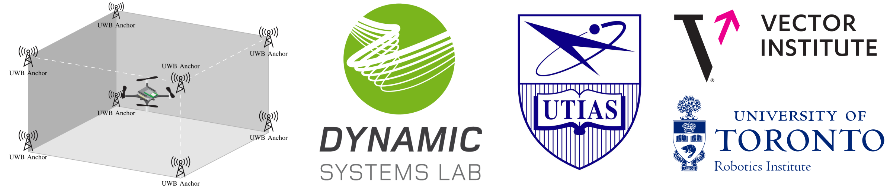
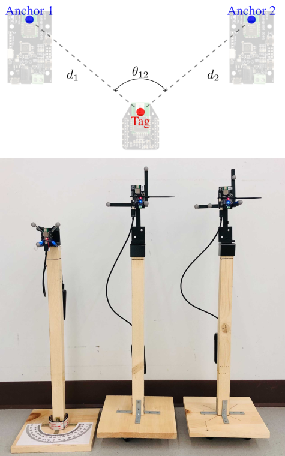
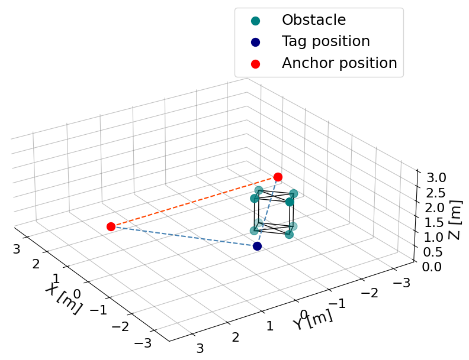
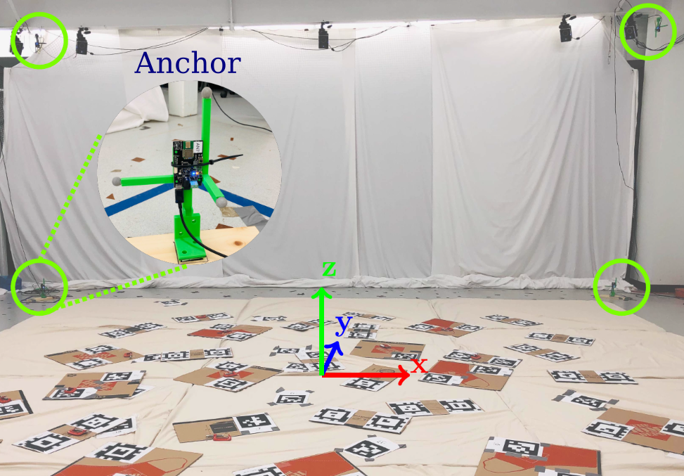
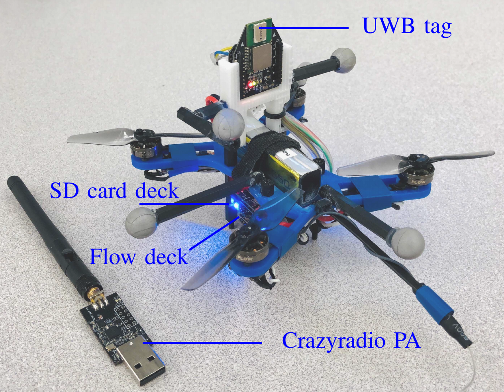
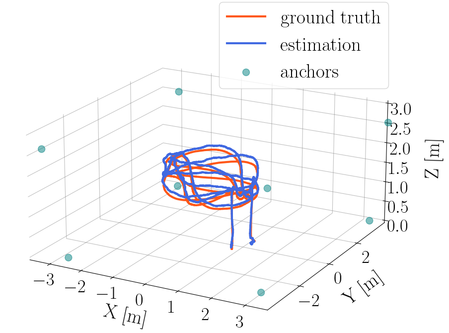
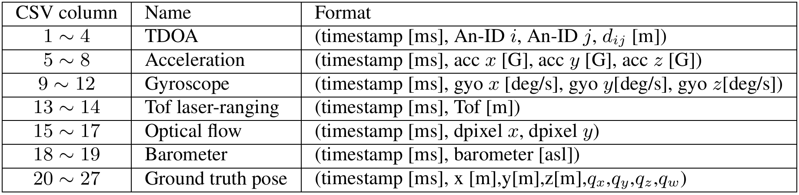

---
## Summary
The UTIAS ultra-wideband (UWB) time-difference-of-arrival (TDOA) consists of low-level signal information from static experiments and UWB TDOA measurements and additional onboard sensor data from flight experiments on a quadrotor. The [Loco Positioning System (LPS)](https://www.bitcraze.io/documentation/system/positioning/loco-positioning-system/) from [Bitcraze](https://www.bitcraze.io/) based on DWM1000 UWB modules is used to create this dataset. We hope this dataset can help researchers develop and compare reliable estimation methods for emerging UWB TDOA-based indoor localization technology. 

---
## Static Dataset
For the static experiments, we collected UWB TDOA measurements under various line-of-sight (LOS) and non-line-of-sight (NLOS) conditions. Two UWB anchors and one [Crazyflie nano-quadrotor](https://www.bitcraze.io/products/old-products/crazyflie-2-0/) equipped with an UWB tag are placed on wooden structures. A millimeter-level accurate Vicon motion capture system measures the poses of the tag and the anchors for groundtruth data.

### Line-of-sight (LOS) experiments
<!-- word -- left, fig -- right -->
<div style="clear: both;">
  <div style="float: right; margin-left 3em;">
    
  </div>
  <div>
    <p>In LOS conditions, we collected data from two tests: (1) the LOS distance test and (2) the LOS angle test. The positions of the tag and anchor 2 are fixed throughout the LOS data collection process. In LOS distance test, we change the distance d1 from 0.5 meters to 6.5 meter with an interval of 0.5 meter.In LOS angle dataset, we change the angle from 180 degree to 15 degree with an interval of 15 degree. </p>
  </div>
</div>

### Non-line-of-sight (NLOS) experiments

<div style="clear: both;">
  <div style="float: right; margin-left 3em;">
    
  </div>
  <div>
    <p>During the NLOS tests, we fixed the positions of the tag and two anchors and placed different obstacles to block the line-of-sight of TDOA measurements. To reflect the comprehensive performance of UWB NLOS measurements, we selected six obstacles of different type of materials commonly used in indoor settings, includingcardboard, metal, wood, plastic, and foam. Both NLOS conditions between one anchor and the tag and between two anchors will affect TDOA measurements. Therefore, we conducted NLOS experiments under (i) NLOS conditions between anchor 1 and the tag and (ii) NLOS condition between anchor 1 and anchor 2. Considering the different radio reflection and diffraction effects with one obstacle under different orientations, we collect six sub-datasets for each NLOS condition with different orientations of the obstacle. One LOS data is collected for comparison.
    </p>
  </div>
</div>
 
### Static dataset format

<div style="clear: both;">
  <div style="float: right; margin-left 3em;">
    
  </div>
  <div>
    <p>In each sub-dataset, we provide a csv file containing the collected data and a txt file containing the poses of the tag and two anchors in one folder. For NLOS tests, the positions of the four markers on the obstacles are also included in the txt file. The format of the csv file and brief descriptions of each value are summarized in table on the right. Detailed information can be found in the dataset paper.
    </p>
    <p>&nbsp;</p>   <!-- line break -->
    <p>&nbsp;</p>
    <p>&nbsp;</p>
    <p>&nbsp;</p>
    <p>&nbsp;</p>
    <p>&nbsp;</p>
    <p>&nbsp;</p>
  </div>
</div>


---
## Flight Dataset
For the flight experiments, we collected the raw UWB meaurements, gyroscope, accelerometer, optical flow, ToF laser-ranging, barometer, and the Vicon pose measurements (sent from the ground station) on-board a customized quadrotor platform.

### Flight arena and experimental setup
<div style="clear: both;">
  <div style="float: right; margin-left 3em;">
    
  </div>
  <div>
    <p>The UWB TDOA flight dataset is produced in a  7.0 m × 8.0 m × 3.5 m indoor flight arena equipped with a motion capture system of 10 <a href="https://www.vicon.com/hardware/cameras/vantage/">Vicon Vantage+ cameras</a>. Printed Apriltags are attached to the soft mattresses to provide visual features for optical flow. For each sub-dataset, eight UWB anchors were pre-installed in the flight arena referred to as a constellation. Three different UWB constellations are used for data collection. The position and orientation of each anchor were surveyed using a mm-level accurate <a href="https://leica-geosystems.com/products/total-stations">Leica total station</a> for reproducibility. We refer to the Vicon frame (see the right figure) as the inertial frame. To align the Leica total station frame and the inertial frame, we use the total station to survey six Vicon reflective markers with known positions in inertial frame and computethe transformation matrix through point cloud alignment. The average reprojection root-mean-squared error (RMSE) of the six reflective markers is around 1.12 mm.
    </p>
    <p>&nbsp;</p>
    <p>&nbsp;</p>
    <p>&nbsp;</p>
  </div>
</div>

### Time synchronization, latency, and calibration
<div style="clear: both;">
  <div style="float: right; margin-left 3em;">
    
  </div>
  <div>
    <p>The UTIAS ultra-wideband (UWB) time-difference-of-arrival (TDOA) consists of low-level signal information from static experiments and UWB TDOA measurements and additional onboard sensor data from flight experiments on a quadrotor. We hope this dataset can help researchers develop and compare reliable estimation methods for emerging UWB TDOA-based indoor localization technology.</p>
    <p>&nbsp;</p>
    <p>&nbsp;</p>
    <p>&nbsp;</p>
  </div>
</div>

### Localization performance
<div style="clear: both;">
  <div style="float: right; margin-left 3em;">
    
  </div>
  <div>
    <p>The UTIAS ultra-wideband (UWB) time-difference-of-arrival (TDOA) consists of low-level signal information from static experiments and UWB TDOA measurements and additional onboard sensor data from flight experiments on a quadrotor. We hope this dataset can help researchers develop and compare reliable estimation methods for emerging UWB TDOA-based indoor localization technology.</p>
    <p>&nbsp;</p>
    <p>&nbsp;</p>
    <p>&nbsp;</p>
  </div>
</div>

### Flight dataset format
The UTIAS ultra-wideband (UWB) time-difference-of-arrival (TDOA) consists of low-level signal information from static experiments and UWB TDOA measurements and additional onboard sensor data from flight experiments on a quadrotor. We hope this dataset can help researchers develop and compare reliable estimation methods for emerging UWB TDOA-based indoor localization technology.



---
## Data Usage

### UWB TDOA measurement modeling


### UWB TDOA-based localization


### UWB bias learning and modeling


## Procedure
---
Step 1. Build ROS messages:
```
$ cd ros_ws/src
$ catkin_init_workspace
$ cd ..
$ catkin_make
$ source devel/setup.bash
```

NOTE: remember to [source both your ROS environment and workspace.](http://wiki.ros.org/ROS/Tutorials/InstallingandConfiguringROSEnvironment#Managing_Your_Environment)

---
## Data parsing scripts for flight dataset
Step 2. Convert SD card binary data to `rosbag`:
```
$ cd dataset/scripts/flight-data/sdcard_scripts
$ python3 log_to_bag.py [SD_CARD_BINARY_DATA]                               # e.g. python3 log_to_bag.py ../../../flight-dataset/binary-data/const1/const1-log1
```

---
Step 3. Visualize the survey results:
```
$ cd dataset/scripts/survey
$ python3 anchor_survey.py [SURVEY_RESULT_TXT]                              # e.g. python3 anchor_survey.py ../../flight-dataset/survey-results/anchor_const1.txt
```

---
Step 4. Visualize UWB measurements:
```
$ cd dataset/scripts/flight-data
$ python3 visual_tdoa2.py -i [ANCHOR_SURVEY_NPZ] [TDOA2_ROSBAG_DATA]        # e.g. python3 visual_tdoa2.py -i ../survey/anchor_const1.npz ../../rosbag/flight-data/rosbag-const1/const1-log1.bag 
$ python3 visual_tdoa3.py -i [ANCHOR_SURVEY_NPZ] [TDOA3_ROSBAG_DATA]        # e.g. python3 visual_tdoa3.py -i ../survey/anchor_const1.npz ../../rosbag/flight-data/rosbag-const1/const1-log7.bag 
```
For TDOA3, the anchor pair of the visualized UWB measurement is set in the script `visual_tdoa3.py`.

---
Step 5. Visualize UWB measurement bias:
```
$ cd dataset/scripts/flight-data
$ python3 visual_bias.py -i [ANCHOR_SURVEY_NPZ] [TDOA_ROSBAG_DATA]          # e.g. python3 visual_bias.py -i ../survey/anchor_const1.npz ../../rosbag/flight-data/rosbag-const1/const1-log1.bag
```
The anchor pair of the visualized UWB measurement is set in the script `visual_bias.py`

---
Step 6. Visualize trajectory and obstacle positions during manual data collections
```
$ cd dataset/scripts/flight-data
$ python3 visual_TrajObs.py -i ../survey/anchor_const3.npz [ROSBAG_DATA]    # e.g. python3 visual_TrajObs.py -i ../survey/anchor_const3.npz ../../rosbag/flight-data/rosbag-const3/const3-tdoa2-obs-log1.bag 
```

---
Step 7. Error-State Kalman Filter Estimation
```
$ cd dataset/scripts/estimation
$ python3 eskf.py -i [ANCHOR_SURVEY_NPZ] [ROSBAG_DATA]                      # e.g. python3 eskf.py -i ../survey/anchor_const1.npz ../../rosbag/flight-data/rosbag-const1/const1-log1.bag
```

---
## Data parsing scripts for static dataset

Step 8. Visualize LOS static data
```
$ cd dataset/scripts/static-data
$ python3 los_visual.py -i [LOS_DATA_FOLDER]                                # e.g. python3 los_visual.py -i ../../static-dataset/los/distTest/distT1
```

---
Step 9. Visualize NLOS static data
```
$ cd dataset/scripts/static-data
$ python3 nlos_visual.py -i [NLOS_DATA_FOLDER]                              # e.g. python3 nlos_visual.py -i ../../static-dataset/nlos/anTag/metal/data1
```

## Credits

This dataset was the work of Wenda Zhao, Abhishek Goudar, and Angela P. Schoellig. 

-----
> University of Toronto's [Dynamic Systems Lab](https://github.com/utiasDSL) / [Vector Institute](https://github.com/VectorInstitute)
